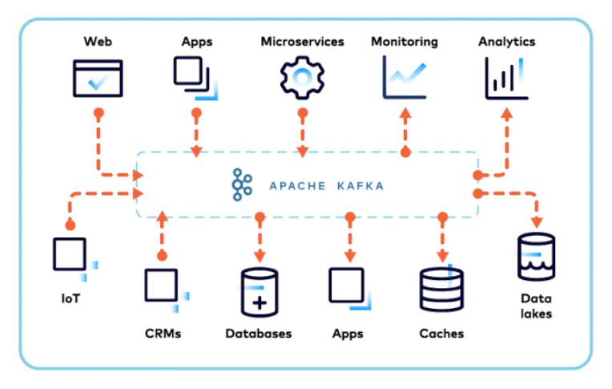
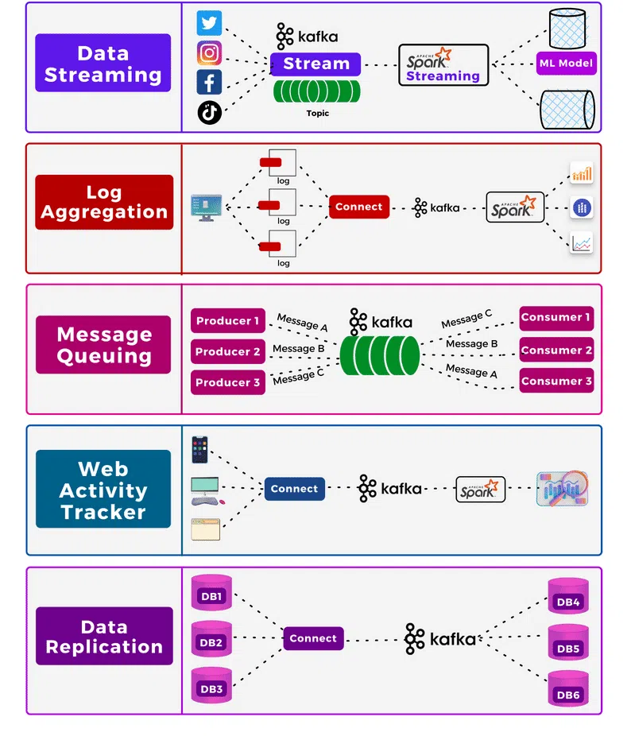
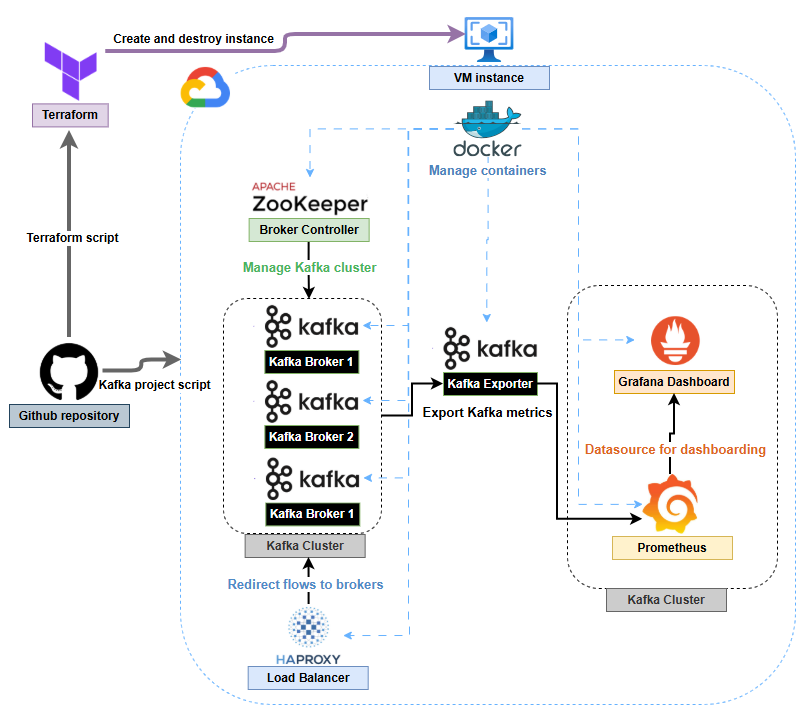

# Kafka Hands-on Training - Wavestone Cloud Forward 🚀

## 🏆 Goal of the Training

This hands-on training is designed to help you deeply understand the inner workings of Apache Kafka and the benefits of event-driven architectures by deploying a complete Kafka cluster on Google Cloud Platform (GCP) using Terraform. You will simulate message streaming with producers, topics, consumer groups, and explore the system’s fault tolerance via monitoring tools.

---

## 📀 Introduction: Event-Driven Architecture (EDA)

### ⚙️ What is Event-Driven Architecture?

Event-Driven Architecture is a software design paradigm in which components of a system communicate by producing and reacting to events. Instead of making direct calls between services (as in API-based designs), services emit events to a central broker and other services subscribe to those events. This decouples components, enabling flexibility and scalability.

### ⚡ Key Concepts:

* **Event:** A change of state or an occurrence that is significant in a system (e.g., a new order placed).
* **Producer:** Emits an event when an action happens.
* **Consumer:** Reacts to the event.
* **Event Broker:** Routes events from producers to consumers (Kafka, RabbitMQ, etc).

### ✨ Benefits of EDA:

* **Loose coupling:** Services don’t need to know about each other.
* **Asynchronous processing:** Enables real-time data pipelines.
* **Scalability:** Each component can scale independently.
* **Flexibility:** Easier to plug in new components or logic.

### 🏛️ Use Cases:

* Fraud detection in banking
* IoT telemetry and real-time analytics
* Microservices communication
* Monitoring and log aggregation

### 🌐 EDA vs. REST APIs:

| Aspect      | REST API                     | Event-Driven Architecture  |
| ----------- | ---------------------------- | -------------------------- |
| Coupling    | Tight (synchronous call)     | Loose (asynchronous event) |
| Flow        | Request/Response             | Publish/Subscribe          |
| Scalability | Limited to synchronous calls | Horizontally scalable      |
| Latency     | Higher under load            | Lower, real-time reaction  |

---

## 📅 Kafka: Core Concepts and Architecture

Apache Kafka is a distributed event streaming platform that enables real-time ingestion and processing of large volumes of data. It works on a publish-subscribe model and is designed for high throughput and low latency.

### 🔄 Components of Kafka:

* **Producer:** Sends data (events) to Kafka topics.
* **Topics:** Logical channels that group messages.
* **Partitions:** Each topic is split into partitions to allow parallelism and scalability.
* **Broker:** A Kafka server that stores data and serves clients.
* **Consumer:** Subscribes to topics to consume messages.
* **Consumer Group:** A group of consumers that share load and coordinate consumption.

### ✨ Key Benefits:

* **Fault-tolerance:** Replication ensures data durability.
* **Scalability:** Easily scaled horizontally.
* **Durability:** Kafka retains messages even after consumption.
* **High performance:** Can handle millions of messages per second.

### 🏛️ Real-World Use Cases:

* Log aggregation
* User activity tracking
* Stream processing
* Event sourcing
* IoT device telemetry

---

## 📚 Goal of the Lab

In this lab, you will:

* Automatically deploy a GCP virtual machine using Terraform.
* Configure the VM to run a Docker-based Kafka cluster.
* Produce and consume messages across multiple topics.
* Monitor Kafka using Prometheus and Grafana.
* Simulate a Kafka broker failure and observe system resilience.

---

## 📘 Architecture Diagram

### 🧠 What this setup demonstrates:

* **3 Kafka brokers** running in containers
* **3 consumer groups** with increasing consumer count (1, 2, and 3)
* **3 producers** sending messages simultaneously
* **Load balancing and failover** via HAProxy
* **Real-time metrics** displayed on Grafana

---

## 🛠️ Lab Instructions

### 🔁 Step 1: Launch GitHub Actions Pipeline

The workflow is triggered manually using the `workflow_dispatch` GitHub Action.

#### 🔹 What it does:

* Uses Terraform to deploy a Debian VM on GCP
* Connects to the VM to install Git, clone the repo, and install Java, Docker, Docker Compose
* Starts the Kafka ecosystem including Kafka cluster, HAProxy, and monitoring stack

### 📨 Step 2: Messaging Simulation

* **3 producers** send messages to unique topics
* **3 topics** are dynamically created
* **3 consumer groups** with:

  * Group 1: 1 consumer
  * Group 2: 2 consumers
  * Group 3: 3 consumers

Consumers are automatically subscribed to appropriate topics and start processing messages.

### ❄️ Step 3: Simulating a Kafka Broker Failure

Manually shut down one broker container.

#### ✅ What to observe:

* Grafana dashboard shows **2/3 brokers active**
* Consumers **continue to process messages** from the remaining brokers
* Demonstrates Kafka’s **fault tolerance and high availability**

---

## 🎉 Conclusion

By completing this lab, you:
✅ Deployed a Kafka cluster on GCP using Terraform
✅ Built an end-to-end event-driven architecture
✅ Simulated a real-world fault and validated system resilience
✅ Monitored Kafka’s health in real time via Grafana

### ✨ Want to go further?

* Use Kafka Connect for database integration
* Add Kafka Streams for stream transformations
* Deploy the stack to Kubernetes
* Integrate Kafka with a full-scale microservice ecosystem

> Thanks for participating in this Kafka training! 🚀
